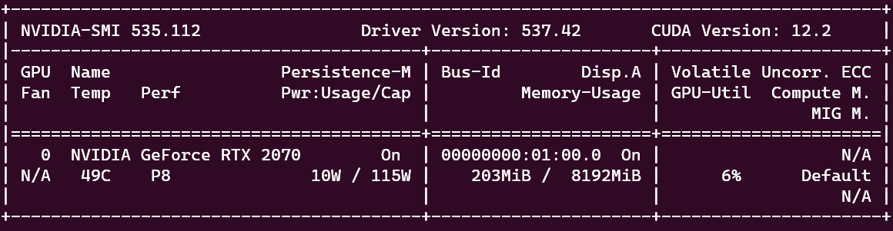

# Dockerのセットアップ方法

## はじめに

- 2024年4月時点のDockerインストール方法です。今後の更新次第では正しくインストールできない可能性があります。

## 動作環境

以下の環境で動作済み

- Ubuntu 22.04
- Docker 26.0.1
- CUDA Drive (nvidia driver) 537.42

## Dockerのインストール方法

1. Dockerのインストールに必要なパッケージをインストール

    ```
    sudo apt-get update
    sudo apt-get install apt-transport-https ca-certificates curl software-properties-common
    ```

2. Docker公式のGPGキーとリポジトリを追加

    ```
    curl -fsSL https://download.docker.com/linux/ubuntu/gpg | sudo gpg --dearmor -o /usr/share/keyrings/docker-archive-keyring.gpg
    echo "deb [arch=amd64 signed-by=/usr/share/keyrings/docker-archive-keyring.gpg] https://download.docker.com/linux/ubuntu $(lsb_release -cs) stable" | sudo tee /etc/apt/sources.list.d/docker.list > /dev/null
    ```

3. Dockerをインストール

    ```
    sudo apt-get update
    sudo apt-get install docker-ce docker-ce-cli containerd.io
    ```

4. Dockerの動作確認

    1. 動作確認用の`hello-world`イメージを実行

        ```
        sudo docker run hello-world
        ```

    2. 動作確認後、`hello-world`イメージを削除

        ```
        sudo docker rmi hello-world
        ```

5. ユーザーをDockerグループに追加

    sudoなしでDockerコマンドを実行できるように、ユーザーをDockerグループに追加します
    
    ```
    sudo usermod -aG docker ${USER}
    sudo systemctl restart docker
    sudo reboot
    ```

    コマンド実行後Ubuntuを再起動、もしくは`sudo systemctl restart docker`を実行してください

## NVIDIA Container Toolkitのインストール方法

0. NVIDIAのGPUドライバがインストールされていることを確認してください。インストールされていない場合は[NVIDIAの公式サイト](https://www.nvidia.co.jp/Download/index.aspx?lang=jp)からインストールしてください。

1. NVIDIA Container ToolkitのGPGキーとリポジトリを追加

    [公式通り](https://docs.nvidia.com/datacenter/cloud-native/container-toolkit/latest/install-guide.html)にNVIDIA Container ToolkitのリポジトリとGPGキーを追加します。

    ```
    curl -fsSL https://nvidia.github.io/libnvidia-container/gpgkey | sudo gpg --dearmor -o /usr/share/keyrings/nvidia-container-toolkit-keyring.gpg \
    && curl -s -L https://nvidia.github.io/libnvidia-container/stable/deb/nvidia-container-toolkit.list | \
    sed 's#deb https://#deb [signed-by=/usr/share/keyrings/nvidia-container-toolkit-keyring.gpg] https://#g' | \
    sudo tee /etc/apt/sources.list.d/nvidia-container-toolkit.list
    ```

2. NVIDIA Container Toolkitのインストール

    ```
    sudo apt-get update
    sudo apt-get install -y nvidia-container-toolkit
    sudo systemctl restart docker
    ```

3.  CUDAの動作確認

    NVIDIA提供の公式CUDAイメージを使用して`nvidia-smi`を実行します。適切なDockerイメージは[Docker Hub](https://hub.docker.com/r/nvidia/cuda/tags)から選択してください。

    > **注意**: 
    > Docker内でCUDAを使用する際は、必ず各環境のCUDA Versionを把握し、そのCUDA Versionに対応したDockerイメージを選択してください。このリポジトリの環境はCUDA Version: 12.2なので、以下のコマンドを使用します。

    ```
    docker run --rm --gpus all nvidia/cuda:12.2.2-runtime-ubuntu22.04 nvidia-smi
    ```

    NVIDIA DriverとCUDAのバージョンがコマンドライン上に表示されればテスト完了です。

    

## 参考文献

- [Install Docker Engine on Ubuntu](https://docs.docker.com/engine/install/ubuntu/)

- [NVIDIA container toolkitを使って、dockerのコンテナ上でcudaを動かす](https://qiita.com/Hiroaki-K4/items/c1be8adba18b9f0b4cef)
