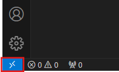
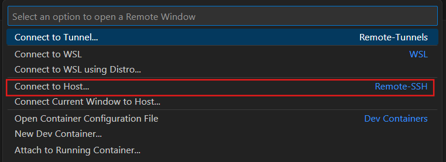
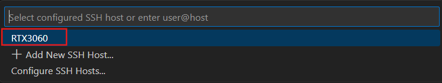
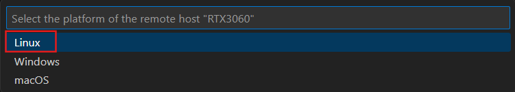
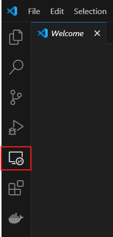
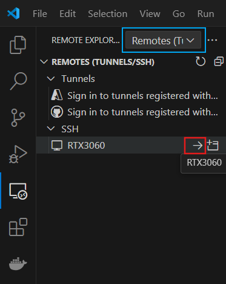
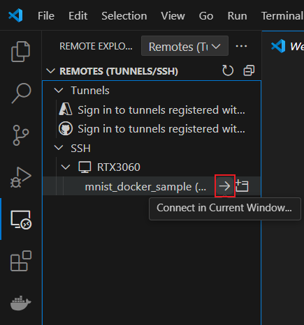

# Remote-SSHの使い方

## はじめに

- 2024年4月時点のRemote-SSHの使い方について説明します。

## Remote-SSHの導入手順

1. VSCodeを利用しているPCでSSH用の公開鍵と秘密鍵を生成

    次のコマンドでローカル環境にSSH用の公開鍵と秘密鍵を生成します。コマンド入力後、3回Enterを押すと鍵の生成が完了します。
    
    ```
    ssh-keygen -t rsa -b 2048
    ```

    `C:/Users/ユーザー名/.ssh/`フォルダ内に以下のファイルが生成されます。
    
    - `id_rsa`：秘密鍵（他の人に教えてはいけない鍵）

    - `id_rsa.pub`：公開鍵（サーバーなど接続先に転送する鍵）

2. 接続先サーバーに公開鍵の内容を入力

    1. SSHでサーバーにログイン
    
        `ssh ユーザー名@xxx.xxx.xxx.xxx(IP アドレス)`=>パスワード入力

    2. `authorized_keys`ファイルの作成と権限設定

        接続先サーバーに公開鍵を登録するためのファイル`authorized_keys`を作成し、適切な権限を設定します。

        ```
        touch ~/.ssh/authorized_keys
        chmod 600 ~/.ssh/authorized_keys
        ```

        権限が正しく変更されているか確認します。次のコマンドの実行結果が`-rw-------`ならOKです。

        ```
        ls -la ~/.ssh/authorized_keys
        ```

    3. 公開鍵の内容を`authorized_keys`に追加

        次の手順で`id_rsa.pub`の内容を authorized_keys に追加します。

        1. 以下のコマンドで`authorized_keys`を開く

            ```
            vi ~/.ssh/authorized_keys
            ```

        2. `C:/Users/ユーザー名/.ssh/id_rsa.pub`をVSCodeで開き、全内容をコピー (`Ctrl+A`=>`Ctrl+C`)

        3. `vi`エディタ内で`o`を押して新しい行に`Ctrl+V`で公開鍵の内容を貼り付け

        4. `Escキー`を押してから`:wq`と入力し、編集を終了


3. VSCodeを利用しているPCの`C:/Users/ユーザー名/.ssh/`フォルダに、拡張子なしで`config`という名前のファイルを作成

    以下の書式で記述します。`xxx.xxx.xxx.xxx`はサーバーのIPアドレス、<ユーザー名>はサーバーのアカウント名を入力してください。

    ```
    Host <任意の名前>
        HostName xxx.xxx.xxx.xxx
        User <ユーザー名>
    ```

    例：

    ```
    Host RTX3060
        HostName 127.0.0.1
        User hogehoge
    ```

4. VSCodeでサーバーにSSH接続

    1. VSCodeの左下の「><」をクリック

        

    2. `Connect to Host...`をクリック

        

    3. `config`ファイルに記載したHost名をクリック

        

    4. サーバーのOSを選択（基本的にLinuxを選択すれば大丈夫です。）

        

## 2回目以降のリモート接続について

接続先サーバーにログインする別の方法として、リモートエクスプローラーを使う方法があります。

1. サイドバーにあるリモートエクスプローラーをクリック

   

2. Host名の横にある`→`をクリックしてサーバーにログイン

    - 水色で囲んだ部分が「Remotes (Tunnels/SSH)」になっていることを確認してください。

   

## サーバー上のVSCodeワークスペースを直接開く

サーバーにログインしながら、サーバー上にあるVSCodeのワークスペースを開くこともできます。これにより、コンテナの起動が容易になります。

- ワークスペースを開いた後、`Ctrl+Shift+P`=>`Dev Containers: Reopen in Container`でコンテナの起動ができます。

    

## 参考文献

- [Visual Studio Code で Remote SSH する。](https://qiita.com/nlog2n2/items/1d1358f6913249f3e186)
